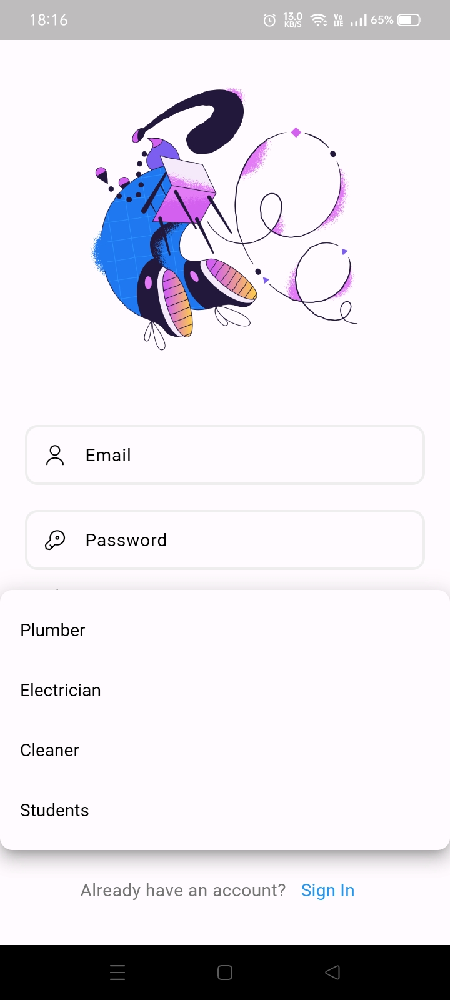

# Hostel Based Advanced Chat App

## Welcome to Smart Campus Connect Readme
Smart Campus Connect is a service-based application designed to cater to students' everyday needs, offering seamless access to essential services like plumbing, electrical assistance, and cleaning.

## What's Special

Efficient Waste Management: Our app integrates ESP32 technology to monitor dustbin capacity. When the dustbin exceeds 75% capacity, cleaners receive instant notifications, ensuring timely waste disposal.

ScreenShots->
Here are just a few screenshots which i took. 
<!-- Table for images -->
<table>
  <tr>
    <td align="center">
      
    </td>
    <td align="center">
      
    </td>
    <td align="center">
      
    </td>
  </tr>
  <tr>
    <td align="center">
      
    </td>
    <td align="center">
      
    </td>
    <td align="center">
      
    </td>
  </tr>
  <tr>
    <td align="center" colspan="3">
      
    </td>
  </tr>
</table>

# Features
- Seamless Service Integration: Connects students with essential services like plumbing, electrical assistance, and cleaning, providing prompt assistance for their needs.

- Message Composition: Each service request includes an image, location, description of the issue, and a checkbox indicating task completion. Both the student and the respective service authority receive this checkbox, ensuring mutual confirmation of task completion.

- Personalized User Experience: Features authentication to ensure secure access, directing users to the appropriate interface based on their role.

# Usage
- Registration: Users can register under one of the four categories - Student, Plumber, Electrician, or Cleaner.

- Service Requests: Students can submit service requests including images, location details, and issue descriptions. Service providers (Plumbers, Electricians, Cleaners) receive these requests and can confirm task completion through a checkbox system.

- Waste Management: The app monitors dustbin capacity through ESP32 technology. When the dustbin reaches 75% capacity, cleaners receive notifications for timely waste disposal.

- Chat Functionality: Users can engage in chat-based communication for issue resolution with service providers.

## Video Demo
Check the App out->
https://youtu.be/6fQSv2MjBd4

## Installation
We have attached an apk file named as app-release.apk [ You can directly install from this file]
OR
Just clone the repository and start running the app your emulator or physical device.

## Tech Stack
- Frontend-> Flutter (Provider state management)
- Backend -> Firebase
- Auth , Cloud Storage and Firestore services are used in this app
  
## Idea 
I have built this app because I saw this issue of having a long procedure just to get a small work done in my hostel.

